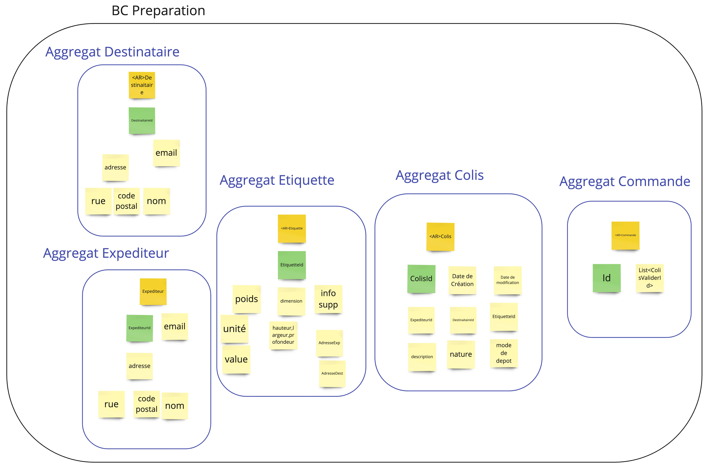

# ddd-training-20230419-laposte

## Event Storming

## Design that tries to solve the whole problem

## Event Storming With Sub-domain

## Event Storming, BC's identification

## Design of a bounded context Preparation

## Bounded context canvas

## Example Mapping

## Hexagonal Architecture

